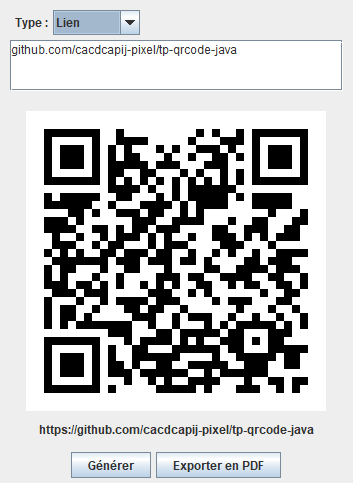

# Rapport – TP Java Générateur de QR code

Charles-André Covin--Dumez – BTS SIO SLAM, 2e année – Saint-Luc Cambrai

## 1. Présentation

L'application permet de saisir une information (texte, lien, adresse email ou numéro de téléphone), d'en générer le QR code, de l'afficher, puis de l'exporter dans un fichier PDF.

Elle est développée en Java avec une interface Swing et respecte le découpage **MVC** (Modèle – Vue – Contrôleur).



## 2. Technologies

| Outil | Rôle |
|---|---|
| Java 21 + Swing | Langage et interface graphique |
| Maven | Gestion du projet et des dépendances |
| ZXing 3.5.3 | Génération (et lecture dans les tests) des QR codes |
| iText 8.0.5 | Création du fichier PDF |
| JUnit 5 | Tests unitaires |

## 3. Architecture MVC

```
src/main/java/
├── modele/
│   ├── TypeContenu.java        types possibles (texte, lien, email, téléphone)
│   ├── FormateurContenu.java   vérifie et met en forme la saisie
│   ├── GenerateurQrCode.java   texte -> image du QR (ZXing)
│   ├── GenerateurPdf.java      image -> fichier PDF (iText)
│   └── QrCodeException.java    erreur métier
├── vue/
│   └── FrmQrCode.java          fenêtre Swing
└── controleur/
    └── Controle.java           main + lien entre vue et modèle
```

- **Modèle** : toute la logique. Il ne connaît pas Swing et ne montre aucun message : en cas de problème il lève une `QrCodeException`.
- **Vue** : la fenêtre. Elle récupère la saisie, transmet les demandes au contrôleur et affiche ce qu'on lui donne. Elle n'appelle jamais ZXing ni iText.
- **Contrôleur** : reçoit les demandes de la vue (`demandeFrmQrCodeGenerer`, `demandeFrmQrCodeExporter`), appelle le modèle, attrape les exceptions et demande à la vue d'afficher le résultat ou l'erreur.

Grâce à ce découpage, le modèle peut être testé sans ouvrir de fenêtre.

### Déroulement d'un clic sur « Générer »

1. `FrmQrCode` lit le type choisi et le texte, puis appelle `Controle.demandeFrmQrCodeGenerer(type, saisie)`.
2. `Controle` demande à `FormateurContenu` de vérifier et formater la saisie.
3. `Controle` passe le contenu formaté à `GenerateurQrCode`, qui renvoie une image.
4. `Controle` appelle `FrmQrCode.afficheQrCode(image, contenu)`.
5. Si une `QrCodeException` est levée à l'étape 2 ou 3, `Controle` appelle `FrmQrCode.afficheErreur(message)`.

### Déroulement d'un clic sur « Exporter en PDF »

1. `FrmQrCode` ouvre un `JFileChooser`, ajoute `.pdf` si besoin et demande confirmation si le fichier existe.
2. `Controle.demandeFrmQrCodeExporter(fichier)` appelle `GenerateurPdf` avec le dernier QR généré.
3. Le PDF contient un titre, le QR code centré et son contenu en légende.

## 4. Utilisation

1. Choisir le type de contenu dans la liste.
2. Saisir le texte, le lien, l'email ou le numéro.
3. Cliquer sur **Générer** : le QR code s'affiche avec le contenu réellement encodé en dessous.
4. Cliquer sur **Exporter en PDF** et choisir l'emplacement du fichier.

Si la saisie est modifiée après la génération, le bouton d'export se désactive : on ne peut pas exporter un QR qui ne correspond plus au texte affiché.

### Types de contenu

| Type | Exemple saisi | Contenu encodé | Vérification |
|---|---|---|---|
| Texte | `Bonjour` | `Bonjour` | non vide |
| Lien | `exemple.fr/page` | `https://exemple.fr/page` | ajoute `https://` si absent, domaine avec un point |
| Email | `eleve@saint-luc.fr` | `mailto:eleve@saint-luc.fr` | format `nom@domaine.ext` |
| Téléphone | `06 12 34 56 78` | `tel:0612345678` | 6 à 15 chiffres, `+` autorisé |

Les préfixes `mailto:` et `tel:` permettent au téléphone qui scanne d'ouvrir directement la messagerie ou l'appel.

## 5. Gestion des erreurs

| Situation | Où c'est détecté | Message affiché |
|---|---|---|
| Saisie vide | `FormateurContenu`, `GenerateurQrCode` | Le texte est vide. |
| Lien, email ou téléphone invalide | `FormateurContenu` | Lien / Adresse email / Numéro invalide : … |
| Texte trop long pour un QR code | `GenerateurQrCode` (WriterException de ZXing) | Texte trop long pour un QR code. |
| Export sans QR généré | `GenerateurPdf` + bouton désactivé | Aucun QR code à exporter. |
| PDF ouvert ailleurs, dossier protégé ou inexistant | `GenerateurPdf` (IOException / PdfException) | Impossible d'écrire le PDF… |
| Fichier déjà existant | `FrmQrCode` | Demande de confirmation |
| Choix du fichier annulé | `FrmQrCode` | Rien, retour à la fenêtre |

Les exceptions des bibliothèques (ZXing, iText) sont transformées en `QrCodeException` dans le modèle. La vue n'a donc jamais à connaître ces bibliothèques.

## 6. Tests

### Tests unitaires (JUnit 5) – 20 tests, tous réussis

Lancement : `mvn test`

| Classe de test | Ce qui est vérifié |
|---|---|
| `GenerateurQrCodeTest` (6) | **Aller-retour** : on génère un QR puis on le relit avec ZXing et on retrouve le texte de départ (lien et texte avec accents) ; taille de l'image ; texte vide, null, trop long → exception |
| `FormateurContenuTest` (11) | Texte inchangé ; lien avec/sans `https://`, `http://` conservé, lien invalide ; email valide/invalide ; téléphone nettoyé (espaces, points, `+33`), invalide ; saisie vide ; type null |
| `GenerateurPdfTest` (3) | Le PDF est créé, non vide et commence par la signature `%PDF` ; image null → exception ; dossier inexistant → exception |

Les tests du PDF utilisent `@TempDir` : les fichiers sont créés dans un dossier temporaire supprimé à la fin.

### Tests manuels de l'application

| Scénario | Résultat attendu | Vérifié |
|---|---|---|
| Lien `github.com/...` puis Générer | QR affiché, contenu `https://github.com/...`, export activé | ✅ |
| Export PDF | PDF avec titre, QR centré et légende | ✅ |
| Scan du QR du PDF | Retrouve le lien de départ | ✅ |
| Générer avec saisie vide | Message « Le texte est vide. » | ✅ |
| Email sans @ | Message d'erreur email | ✅ |
| Modifier le texte après génération | Bouton Exporter désactivé | ✅ |
| Exporter vers un PDF ouvert dans un lecteur | Message « Impossible d'écrire le PDF » | ✅ |
| Exporter vers un fichier existant | Demande de confirmation | ✅ |
| Scanner le QR avec un téléphone | Ouvre le lien / l'email / l'appel | ✅ |

## 7. Documentation du code

Chaque classe et méthode publique a un commentaire Javadoc. La documentation HTML se génère avec :

```
mvn javadoc:javadoc
```

Elle est créée dans `target/reports/apidocs/index.html`.

## 8. Limites et améliorations possibles

- Un seul QR code par PDF : on pourrait regrouper plusieurs QR sur une même page.
- Types Wi-Fi et carte de visite (vCard) non gérés : ils demandent plusieurs champs de saisie.
- Pas de choix de taille ou de couleur du QR.
- iText est sous licence AGPL : pour une application commerciale, il faudrait une licence payante ou une bibliothèque libre comme OpenPDF ou Apache PDFBox.
