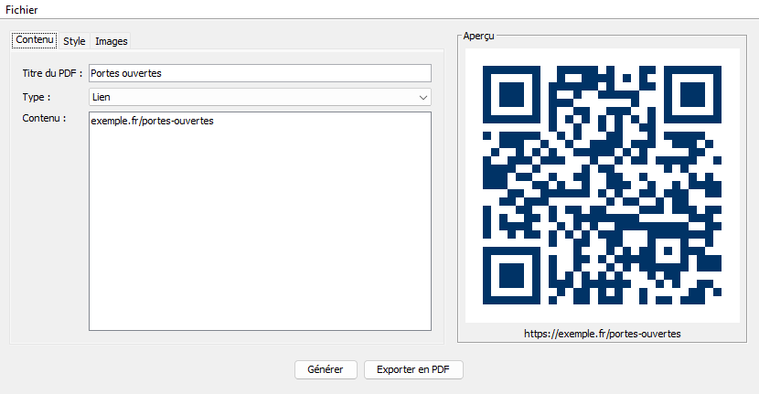
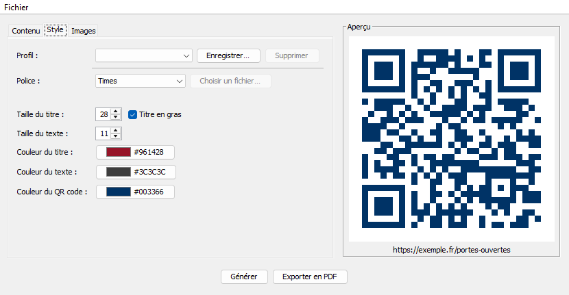
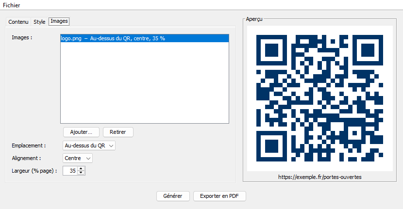

# Rapport – TP Générateur de QR code, partie 2

Charles-André Covin--Dumez – BTS SIO SLAM, 2e année – Saint-Luc Cambrai

Ce rapport décrit l'évolution de l'application depuis la partie 1 (voir [RAPPORT.md](RAPPORT.md)) : les nouvelles fonctionnalités, les changements dans l'architecture MVC, les tests et les difficultés rencontrées.

## 1. Nouvelles fonctionnalités

| Demande du sujet | Ce qui a été fait |
|---|---|
| Polices personnalisées | Choix entre Helvetica, Times, Courier (polices standard du PDF) ou n'importe quel fichier `.ttf` / `.otf`, qui est alors intégré au PDF |
| Couleurs et styles | Taille du titre et du texte, titre en gras, couleur du titre, du texte et du QR code |
| Images dans le PDF | Plusieurs images par PDF ; pour chacune : emplacement (au-dessus ou sous le QR), alignement (gauche, centre, droite) et largeur en % de la page |
| Sauvegarde / chargement des projets | Menu Fichier : Nouveau, Ouvrir, Enregistrer, Enregistrer sous. Un projet (`.qrproj`) contient le titre, le type, la saisie, le style et les images |
| Sauvegarde / chargement des profils | Un profil = un style (police, tailles, couleurs). Enregistré sous un nom, choisi dans une liste déroulante |
| Amélioration de l'interface (facultatif) | Onglets, raccourcis clavier, barre de progression pendant l'export, proposition d'ouvrir le PDF créé, nom du projet dans la barre de titre, apparence Windows |

## 2. L'interface

La fenêtre est découpée en trois onglets, avec l'aperçu du QR code toujours visible à droite.

**Contenu** : titre du PDF, type de contenu et saisie.



**Style** : profil, police, tailles et couleurs. Les boutons de couleur ouvrent un sélecteur et affichent la couleur choisie avec son code.



**Images** : liste des images ajoutées et réglages de l'image sélectionnée.



PDF obtenu avec ces réglages (Times gras bordeaux, logo à 35 % au-dessus du QR, QR bleu marine) :


### Menu Fichier

| Commande | Raccourci |
|---|---|
| Nouveau projet | Ctrl+N |
| Ouvrir un projet… | Ctrl+O |
| Enregistrer | Ctrl+S |
| Enregistrer sous… | Ctrl+Maj+S |
| Exporter en PDF… | Ctrl+E |
| Quitter | Ctrl+Q |

« Enregistrer » réutilise le fichier du projet ouvert ; la première fois, il demande où enregistrer.

## 3. Évolution de l'architecture MVC

Le découpage de la partie 1 est conservé : toute la logique est dans le modèle, la vue ne fait qu'afficher et transmettre, le contrôleur fait le lien.

```
src/main/java/
├── modele/
│   ├── TypeContenu.java          (partie 1)
│   ├── FormateurContenu.java     (partie 1)
│   ├── GenerateurQrCode.java     + couleur du QR
│   ├── GenerateurPdf.java        + style, police, images
│   ├── QrCodeException.java      (partie 1)
│   ├── Projet.java               NOUVEAU  titre, contenu, profil, images
│   ├── ProfilPdf.java            NOUVEAU  police, tailles, couleurs
│   ├── PolicePdf.java            NOUVEAU  Helvetica / Times / Courier / fichier
│   ├── ImagePdf.java             NOUVEAU  fichier, emplacement, alignement, largeur
│   ├── EmplacementImage.java     NOUVEAU  au-dessus / sous le QR
│   ├── AlignementImage.java      NOUVEAU  gauche / centre / droite
│   ├── Sauvegarde.java           NOUVEAU  lecture / écriture JSON (Gson)
│   └── GestionProfils.java       NOUVEAU  profils rangés par nom dans un dossier
├── vue/
│   └── FrmQrCode.java            onglets, menu, barre de progression
└── controleur/
    └── Controle.java             nouvelles demandes de la vue
```

`Projet`, `ProfilPdf` et `ImagePdf` sont de simples objets de données : la vue les remplit à partir de ses champs (`lireProjet()`, `lireProfil()`) et les passe au contrôleur, qui les donne au modèle.

### Nouvelles demandes du contrôleur

| Méthode de `Controle` | Appelée par | Rôle |
|---|---|---|
| `demandeFrmQrCodeGenerer(type, saisie, couleurQr)` | bouton Générer, changement de couleur du QR | génère l'aperçu dans la couleur choisie |
| `demandeFrmQrCodeExporter(projet, fichier)` | bouton / menu Exporter | crée le PDF en arrière-plan (`SwingWorker`) |
| `demandeFrmQrCodeNouveauProjet()` | menu Nouveau | remet la fenêtre à zéro |
| `demandeFrmQrCodeOuvrirProjet(fichier)` | menu Ouvrir | relit le projet, remplit la fenêtre, régénère le QR |
| `demandeFrmQrCodeEnregistrerProjet(projet, fichier)` | menu Enregistrer | écrit le fichier `.qrproj` |
| `demandeFrmQrCodeChargerProfil(nom)` | liste des profils | applique le profil choisi (ou le style par défaut) |
| `demandeFrmQrCodeEnregistrerProfil(profil)` | bouton Enregistrer… | enregistre le style sous un nom |
| `demandeFrmQrCodeSupprimerProfil(nom)` | bouton Supprimer | supprime le profil |
| `demandeFrmQrCodeProfilExiste(nom)` | bouton Enregistrer… | permet de demander confirmation avant d'écraser |

### Déroulement d'un export

1. La vue demande un fichier (`JFileChooser`), puis construit le `Projet` avec `lireProjet()`.
2. `Controle` affiche la barre de progression et lance un `SwingWorker`.
3. En arrière-plan : `GenerateurQrCode` refait le QR dans la couleur du profil, puis `GenerateurPdf` crée le PDF.
4. De retour dans le thread de la fenêtre : la barre disparaît, puis la vue affiche soit l'erreur, soit « PDF enregistré, l'ouvrir ? ».

Contenu du PDF, dans l'ordre : titre, images « au-dessus du QR », QR code, contenu encodé en légende, images « sous le QR ».

## 4. Sauvegarde des projets et des profils

Les fichiers sont au format **JSON**, écrits et relus avec la bibliothèque **Gson**. Le JSON a été choisi parce qu'il est lisible et modifiable à la main, contrairement à la sérialisation Java qui produit un fichier binaire et casse dès qu'une classe change.

Exemple de fichier `.qrproj` :

```json
{
  "format": "qrcode-projet",
  "titre": "Portes ouvertes",
  "type": "LIEN",
  "saisie": "exemple.fr/portes-ouvertes",
  "profil": {
    "format": "qrcode-profil",
    "nom": "",
    "police": "TIMES",
    "tailleTitre": 28,
    "tailleTexte": 11,
    "titreGras": true,
    "couleurTitre": "#961428",
    "couleurTexte": "#3C3C3C",
    "couleurQr": "#003366"
  },
  "images": [
    {
      "chemin": "C:\\...\\logo.png",
      "emplacement": "HAUT",
      "alignement": "CENTRE",
      "largeur": 35
    }
  ]
}
```

- **Projets** : enregistrés où l'utilisateur veut, avec l'extension `.qrproj`.
- **Profils** : un fichier `nom.json` par profil dans `~/.qrcode/profils` (dossier personnel de l'utilisateur, créé au premier enregistrement). La liste déroulante affiche les profils trouvés dans ce dossier.

La liste affiche « Par défaut » quand le style correspond au style d'origine, le nom du profil quand il vient d'être choisi ou enregistré, et reste vide pour un style qui n'a pas été enregistré (par exemple celui d'un projet ouvert).

## 5. Gestion des erreurs

Comme dans la partie 1, le modèle lève une `QrCodeException` avec un message clair, le contrôleur l'attrape et la vue l'affiche. Erreurs ajoutées :

| Situation | Où c'est détecté | Message affiché |
|---|---|---|
| Couleur du QR trop claire | `GenerateurQrCode` | Couleur du QR code trop claire : il ne serait pas lisible… |
| Police personnalisée sans fichier | `GenerateurPdf` | Aucun fichier de police choisi. |
| Fichier de police supprimé ou déplacé | `GenerateurPdf` | Police introuvable : … |
| Fichier de police abîmé | `GenerateurPdf` | Police invalide : … |
| Image supprimée ou déplacée | `GenerateurPdf` | Image introuvable : … |
| Fichier qui n'est pas une image | `GenerateurPdf` | Format d'image non pris en charge : … |
| Projet introuvable | `Sauvegarde` | Fichier introuvable : … |
| JSON abîmé ou vide | `Sauvegarde` | Le fichier « … » est abîmé ou n'a pas le bon format. |
| Profil ouvert à la place d'un projet (et inversement) | `Projet.valider()`, `ProfilPdf.valider()` | Ce fichier n'est pas un projet. |
| Valeur modifiée à la main (couleur, taille, type inconnu) | `valider()` | Projet invalide / Profil invalide : … |
| Nom de profil vide ou avec `\ / : * ? " < > \|` | `GestionProfils` | Nom de profil invalide… |
| Dossier inexistant ou protégé à l'enregistrement | `Sauvegarde` | Impossible d'enregistrer « … » |

Dans la vue : confirmation avant d'écraser un fichier ou un profil existant, avant de supprimer un profil, et annulation possible de chaque sélecteur de fichier.

## 6. Tests

### Tests unitaires

Lancement : `mvn test` → **52 tests, tous réussis** (20 dans la partie 1).

| Classe de test | Ce qui est vérifié |
|---|---|
| `GenerateurQrCodeTest` (8) | Partie 1 + **QR en couleur relu par ZXing** ; fond blanc ; couleur trop claire refusée |
| `FormateurContenuTest` (11) | inchangé depuis la partie 1 |
| `GenerateurPdfTest` (9) | Partie 1 + **PDF stylé relu avec iText** : on vérifie que le titre et la légende sont bien dans le texte de la page et qu'il y a 3 images (QR + 2 images ajoutées) ; image introuvable → exception **et aucun fichier créé** ; fichier qui n'est pas une image ; police personnalisée sans fichier ou introuvable ; **police Arial intégrée** et accents corrects (test ignoré si la police n'existe pas sur la machine) |
| `SauvegardeTest` (11) | **Aller-retour** : un projet enregistré puis relu redonne les mêmes valeurs (titre, type, style, images) ; fichier lisible ; profil aller-retour ; fichier introuvable, JSON abîmé, fichier vide ; profil ouvert comme projet et inversement ; couleur ou type modifiés à la main ; dossier inexistant |
| `GestionProfilsTest` (7) | Enregistrer, lister (tri alphabétique), charger ; remplacer un profil ; supprimer ; profil inconnu ; noms invalides (vide, `/`, `?`, trop long) ; espaces retirés autour du nom |
| `ProfilPdfTest` (6) | Profil par défaut valide ; conversion des couleurs ; tailles hors limites ; police personnalisée sans fichier ; comparaison de styles ; copie indépendante |

### Tests de l'application

| Scénario | Résultat attendu | Vérifié |
|---|---|---|
| Changer la couleur du QR après génération | L'aperçu se met à jour dans la nouvelle couleur | à faire |
| Exporter avec style et image | PDF conforme (voir capture section 2) | ✅ |
| Pendant l'export | Barre de progression visible, boutons désactivés | ✅ |
| Enregistrer un projet, Nouveau, puis Ouvrir | Tous les champs, le style et les images reviennent, le QR est régénéré, le nom du fichier s'affiche dans la barre de titre | ✅ |
| Enregistrer un profil | Le profil apparaît et est sélectionné dans la liste | ✅ |
| Supprimer un profil | Il disparaît de la liste | ✅ |
| Nouveau projet | Style par défaut, « Par défaut » sélectionné, aperçu vidé | ✅ |
| Scanner le QR coloré du PDF avec un téléphone | Ouvre le lien | à faire |
| Choisir une police `.ttf` dans l'interface puis exporter | Titre et légende dans cette police | à faire |

## 7. Difficultés rencontrées

**Gras avec une police personnalisée.** Les polices standard du PDF ont une version grasse séparée (Times-Bold…), mais un fichier `.ttf` n'en contient qu'une. Pour le titre en gras, iText simule alors le gras (`setBold()`), en épaississant le contour des lettres.

**Accents et caractères spéciaux.** Une police personnalisée est chargée en `IDENTITY_H` (Unicode) et intégrée au PDF : sans ça, les accents et des caractères comme « – » peuvent manquer à l'affichage sur une autre machine. Le test avec Arial vérifie que « Élève – police intégrée » se relit correctement.

**Taille des images.** Une image très haute peut repousser le QR sur une deuxième page. La largeur est donc donnée en % de la largeur utile de la page, les proportions sont gardées, et la hauteur est limitée à 250 points.

**PDF à moitié écrit.** Dans la partie 1, si une erreur arrivait pendant l'écriture, un fichier PDF incomplet pouvait rester sur le disque. Avec les images et les polices, les risques d'erreur augmentent. Le PDF est maintenant construit en mémoire, puis écrit d'un seul coup à la fin : en cas d'erreur, aucun fichier n'est créé (vérifié par un test).

**Couleurs dans le JSON.** `java.awt.Color` ne s'enregistre pas proprement avec Gson. Les couleurs sont donc stockées en texte `#RRGGBB` dans `ProfilPdf`, et converties en `Color` par les getters. Le fichier reste lisible.

**Reconnaître un mauvais fichier.** Gson remplit l'objet avec ce qu'il trouve, sans vérifier : un profil ouvert comme projet donnerait un projet par défaut sans aucune erreur, et une valeur inconnue (ex. type `"FAX"`) devient `null`. Chaque fichier contient donc un champ `format`, et `valider()` vérifie toutes les valeurs après la lecture.

**QR illisible.** Un QR jaune sur fond blanc n'est pas scannable. La luminosité de la couleur est calculée et les couleurs trop claires sont refusées avec un message.

**Fenêtre figée pendant l'export.** Dans la partie 1, la création du PDF se faisait dans le thread de la fenêtre, qui est bloquée pendant ce temps ; avec des images et une police à intégrer, l'export prend plus de temps. Il passe maintenant par un `SwingWorker` : le travail se fait en arrière-plan et le résultat revient dans le thread de la fenêtre pour l'affichage.

**Événements déclenchés par le code.** Quand la vue remplit ses champs (ouverture d'un projet, choix d'un profil), Swing déclenche les mêmes événements que si l'utilisateur les modifiait : sélectionner un profil dans la liste par code relancerait son chargement, qui resélectionnerait le profil, etc. Un booléen `majEnCours` permet d'ignorer ces événements pendant le remplissage.

## 8. Limites et améliorations possibles

- Les images et la police personnalisée sont enregistrées par leur chemin : si le fichier est déplacé, l'export affiche une erreur. On pourrait copier ces fichiers à côté du projet.
- Pas d'aperçu du PDF dans la fenêtre avant l'export.
- Pas d'avertissement si on ferme la fenêtre sans avoir enregistré le projet.
- Les profils sont stockés par utilisateur Windows, il n'y a pas de comptes dans l'application.
